# Aviator Architecture

Comprehensive system design documentation for the Aviator latency-aware traffic routing operator.

---

## Table of Contents

- [System Overview](#system-overview)
- [Component Architecture](#component-architecture)
- [Data Flow](#data-flow)
- [CRD Design](#crd-design)
- [eBPF Agent Design](#ebpf-agent-design)
- [Controller Design](#controller-design)
- [Circuit Breaker State Machine](#circuit-breaker-state-machine)
- [EndpointSlice Ownership Model](#endpointslice-ownership-model)
- [Dampening Algorithm](#dampening-algorithm)
- [Design Patterns](#design-patterns)
- [Directory Structure](#directory-structure)
- [Deployment Topology](#deployment-topology)
- [CLI Reference](#cli-reference)
- [Kernel Requirements](#kernel-requirements)

---

## System Overview

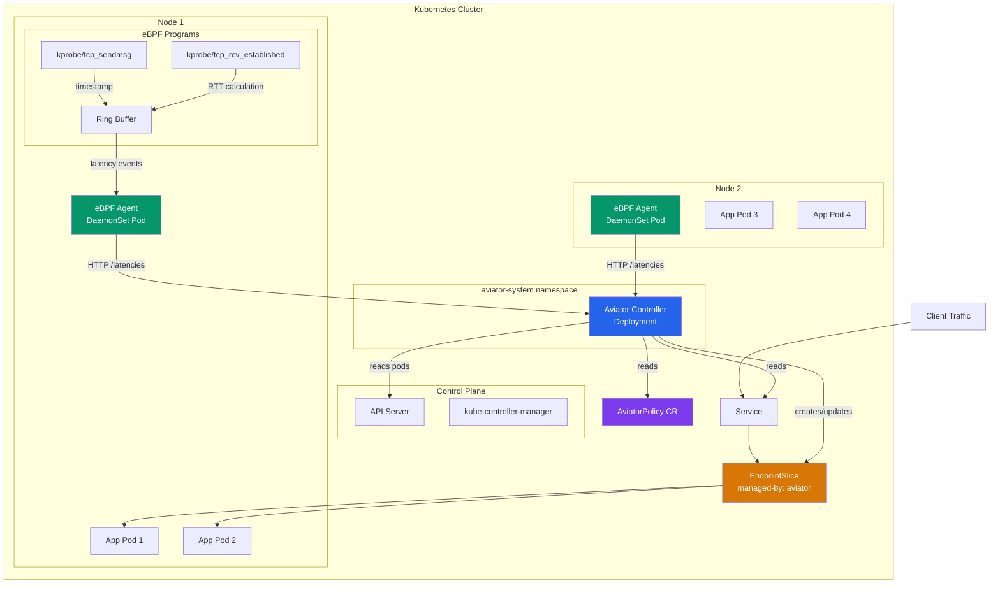

---

## Component Architecture

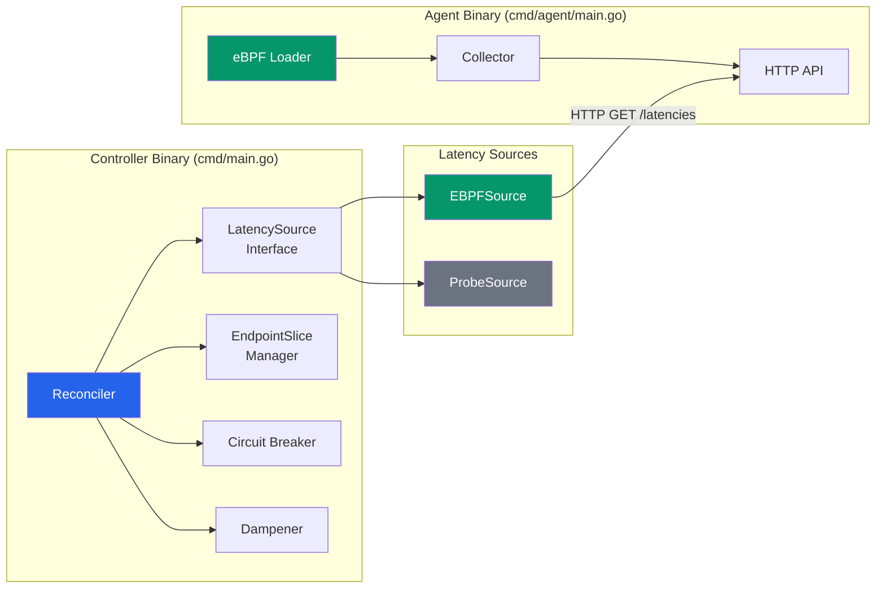

### Component Responsibilities

| Component | Location | Responsibility |
|---|---|---|
| **Reconciler** | `internal/controller/` | Orchestrates the reconciliation loop |
| **LatencySource** | `internal/latency/source.go` | Interface for latency data backends |
| **EBPFSource** | `internal/latency/ebpf_source.go` | Fetches latency from eBPF agents |
| **ProbeSource** | `internal/latency/probe_source.go` | HTTP probe fallback |
| **Aggregator** | `internal/latency/aggregator.go` | Pod ranking, selection, fleet stats |
| **CircuitBreaker** | `internal/circuitbreaker/` | Pod ejection/recovery state machine |
| **EndpointSliceManager** | `internal/endpointslice/` | Creates/updates owned EndpointSlices |
| **eBPF Loader** | `internal/ebpf/loader.go` | Loads and attaches BPF programs |
| **Collector** | `internal/ebpf/collector.go` | Aggregates ring buffer events into stats |

---

## Data Flow

### Reconciliation Loop

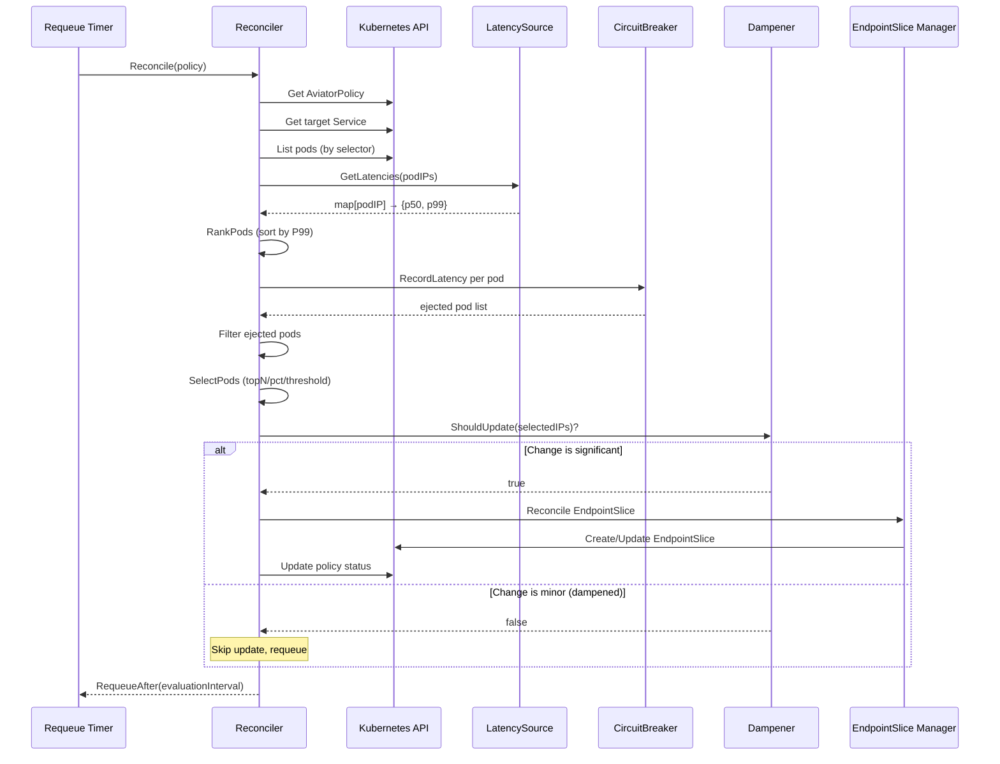

### eBPF Agent Data Path

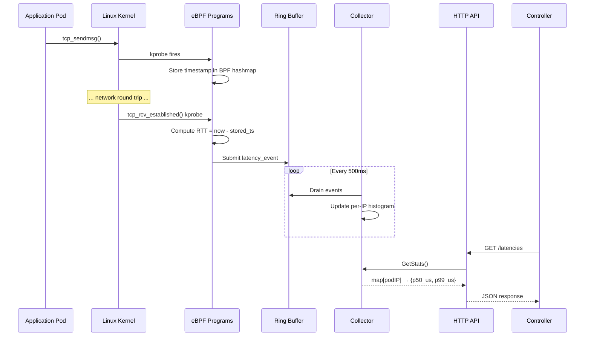

---

## CRD Design

### AviatorPolicy Resource

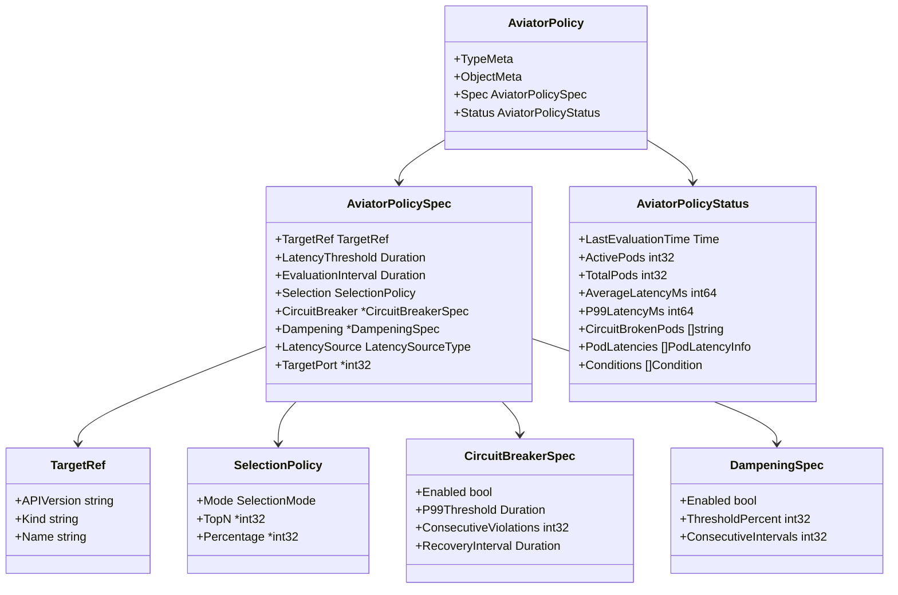

### Selection Modes

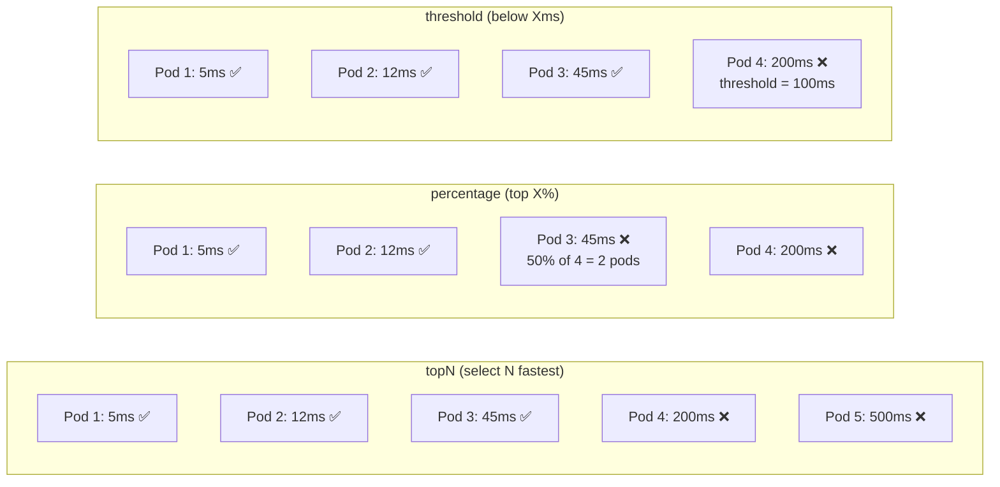

---

## eBPF Agent Design

### BPF Program Architecture

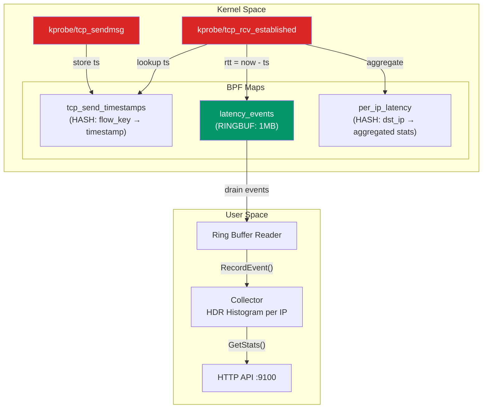

### BPF Data Structures

```c
// Flow key - identifies a TCP connection
struct flow_key {
    __u32 src_ip;
    __u32 dst_ip;
    __u16 src_port;
    __u16 dst_port;
};

// Latency event - sent to userspace
struct latency_event {
    __u32 src_ip;
    __u32 dst_ip;
    __u16 src_port;
    __u16 dst_port;
    __u64 rtt_ns;
    __u64 timestamp_ns;
};
```

---

## Controller Design

### Reconciler Interface Composition

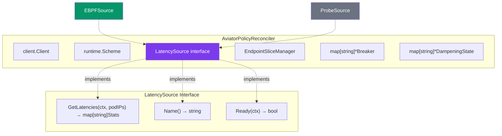

### Reconciliation State Machine

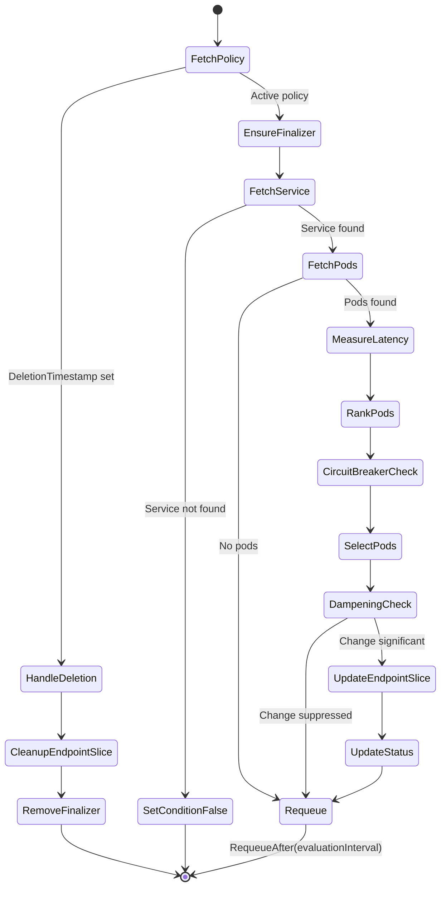

---

## Circuit Breaker State Machine

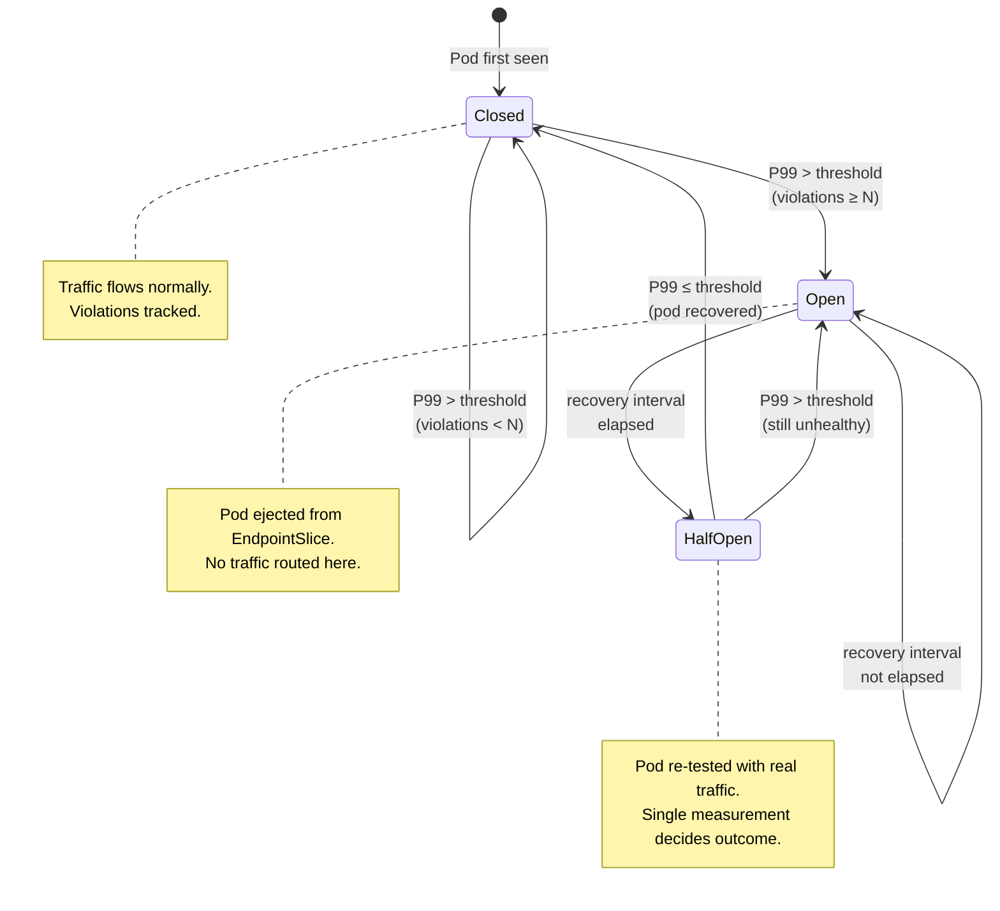

### Circuit Breaker Example Timeline

```
Time    Pod-A P99    Violations    State
─────────────────────────────────────────
t=0     45ms         0            CLOSED
t=5     120ms        1            CLOSED     (threshold: 100ms)
t=10    150ms        2            CLOSED
t=15    200ms        3            → OPEN     (ejected!)
t=20    ---          ---          OPEN       (no traffic)
t=25    ---          ---          OPEN
t=30    ---          ---          OPEN
t=45    ---          ---          → HALF_OPEN (recovery interval: 30s)
t=50    60ms         0            → CLOSED   (recovered!)
```

---

## EndpointSlice Ownership Model

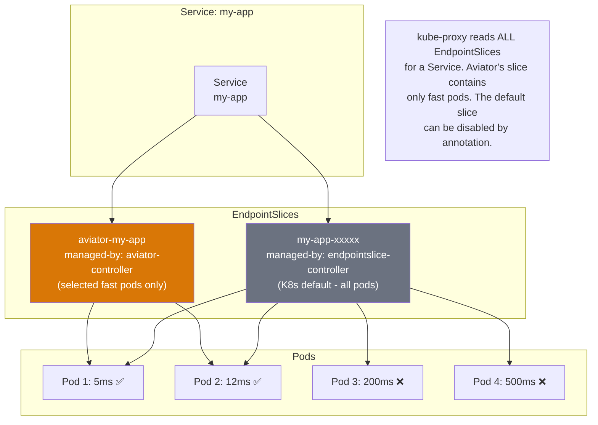

### Ownership Labels

```yaml
apiVersion: discovery.k8s.io/v1
kind: EndpointSlice
metadata:
  name: aviator-my-app
  labels:
    kubernetes.io/service-name: my-app          # Links to Service
    endpointslice.kubernetes.io/managed-by: aviator-controller  # Ownership
    aviator.io/policy-name: my-app-policy       # Links to AviatorPolicy
  ownerReferences:
    - apiVersion: aviator.example.com/v1alpha1
      kind: AviatorPolicy
      name: my-app-policy
```

---

## Dampening Algorithm

Prevents endpoint flapping when pod latencies fluctuate around selection boundaries.

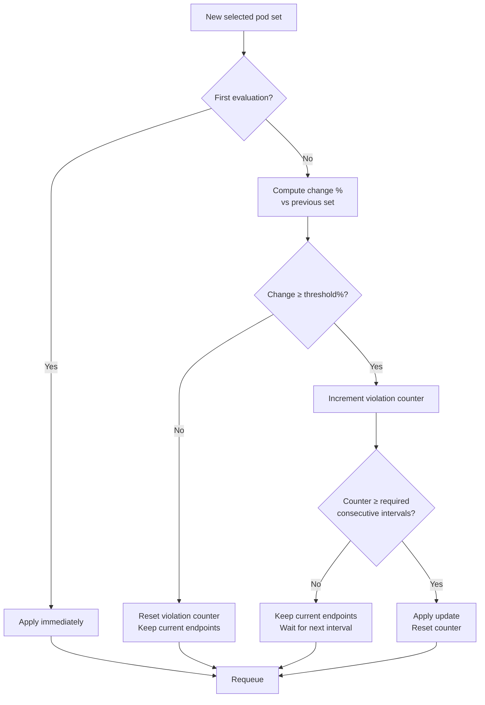

**Example**: With `thresholdPercent: 20` and `consecutiveIntervals: 3`:

```
Interval 1: Selected = [A, B, C]     → Apply (first time)
Interval 2: Selected = [A, B, D]     → 33% change, violation=1, suppress
Interval 3: Selected = [A, B, D]     → 33% change, violation=2, suppress
Interval 4: Selected = [A, B, D]     → 33% change, violation=3 → APPLY
Interval 5: Selected = [A, B, C]     → 33% change, violation=1, suppress
Interval 6: Selected = [A, B, D]     → Different from interval 5's pending, reset
```

---

## Design Patterns

### 1. Strategy Pattern — Pod Selection

The controller uses the Strategy pattern for pod selection, configured via the CRD:

```go
type SelectionMode string
const (
    SelectionModeTopN       SelectionMode = "topN"
    SelectionModePercentage SelectionMode = "percentage"
    SelectionModeThreshold  SelectionMode = "threshold"
)
```

Each mode is implemented as a pure function in `internal/latency/aggregator.go`:
- `SelectTopN(ranked, n)` — Fixed count
- `SelectTopPercent(ranked, percent)` — Percentage-based
- `SelectByThreshold(ranked, threshold)` — Latency ceiling

### 2. Interface Segregation — LatencySource

```go
type Source interface {
    GetLatencies(ctx context.Context, podIPs []string) (map[string]Stats, error)
    Name() string
    Ready(ctx context.Context) bool
}
```

Two implementations:
- `EBPFSource` — Reads from DaemonSet agents over HTTP
- `ProbeSource` — Direct HTTP probing (fallback)

The controller doesn't know or care which backend is active.

### 3. State Machine — Circuit Breaker

The circuit breaker uses a classic three-state machine (Closed → Open → Half-Open) with per-pod tracking. State transitions are driven by latency observations, not timers.

### 4. Observer Pattern — Controller-Runtime Watches

The controller watches:
- `AviatorPolicy` resources (primary)
- `EndpointSlice` resources owned by Aviator (secondary)

Changes to either trigger reconciliation.

### 5. Finalizer Pattern — Resource Cleanup

When an AviatorPolicy is deleted:
1. Finalizer prevents immediate deletion
2. Controller cleans up owned EndpointSlices
3. Controller removes circuit breaker and dampener state
4. Finalizer is removed, allowing garbage collection

---

## Directory Structure

```
aviator/
├── api/
│   └── v1alpha1/
│       ├── aviatorpolicy_types.go      # CRD type definitions
│       ├── groupversion_info.go        # API group metadata
│       └── zz_generated.deepcopy.go    # Auto-generated (make generate)
│
├── cmd/
│   ├── main.go                         # Controller entrypoint
│   └── agent/
│       └── main.go                     # eBPF agent entrypoint
│
├── internal/
│   ├── controller/
│   │   ├── aviatorpolicy_controller.go      # Main reconciler
│   │   ├── aviatorpolicy_controller_test.go # Integration tests
│   │   └── suite_test.go                    # Test suite setup
│   │
│   ├── latency/
│   │   ├── source.go                   # LatencySource interface
│   │   ├── ebpf_source.go             # eBPF agent client
│   │   ├── probe_source.go            # HTTP probe fallback
│   │   ├── aggregator.go              # Ranking, selection, fleet stats
│   │   └── aggregator_test.go         # Unit tests
│   │
│   ├── circuitbreaker/
│   │   ├── circuitbreaker.go          # State machine implementation
│   │   └── circuitbreaker_test.go     # Unit tests
│   │
│   ├── endpointslice/
│   │   └── manager.go                 # EndpointSlice CRUD with ownership
│   │
│   └── ebpf/
│       ├── bpf/
│       │   └── tcp_latency.c          # eBPF C program (kernel space)
│       ├── loader.go                  # BPF program lifecycle management
│       ├── collector.go               # Event aggregation + histograms
│       └── collector_test.go          # Unit tests
│
├── config/
│   ├── crd/                           # CRD manifests
│   ├── rbac/                          # Controller RBAC
│   ├── manager/                       # Controller Deployment
│   ├── agent/                         # eBPF DaemonSet + RBAC
│   ├── samples/                       # Example AviatorPolicy
│   ├── prometheus/                    # Monitoring config
│   └── network-policy/               # Network policies
│
├── test/
│   ├── functional/                    # Fast/slow test apps
│   └── e2e/                          # End-to-end tests
│
├── Dockerfile                         # Controller image
├── Dockerfile.agent                   # eBPF agent image
├── Makefile                          # Build, test, deploy targets
├── go.mod / go.sum                   # Go dependencies
└── ARCHITECTURE.md                   # This file
```

---

## Deployment Topology

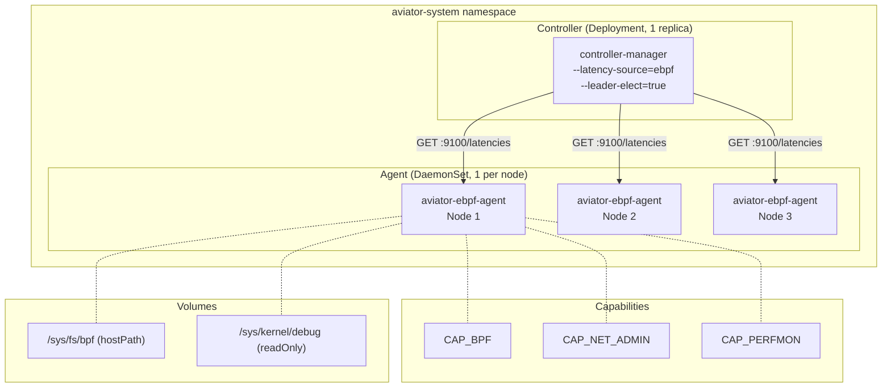

---

## CLI Reference

### Build Commands

```bash
make build                 # Build controller binary
make build-agent           # Build eBPF agent binary
make docker-build          # Build controller Docker image
make docker-build-agent    # Build agent Docker image
make docker-build-all      # Build both images
```

### Deploy Commands

```bash
make install               # Install CRDs only
make deploy                # Deploy controller to cluster
make deploy-agent          # Deploy eBPF agent DaemonSet
make deploy-all            # Deploy controller + agent
make undeploy-all          # Remove everything
```

### Test Commands

```bash
make test-unit             # Unit tests (no cluster)
make test                  # Full suite with envtest
make test-e2e              # E2E tests (requires Kind)
make lint                  # Run golangci-lint
```

### Development Commands

```bash
make run                   # Run controller locally (probe mode)
make manifests             # Regenerate CRD/RBAC manifests
make generate              # Regenerate DeepCopy methods
make generate-yaml         # Generate deployment YAMLs
```

### kubectl Commands

```bash
kubectl get avp                         # List all AviatorPolicies (short name)
kubectl describe avp <name>             # Detailed status with pod latencies
kubectl get endpointslices -l endpointslice.kubernetes.io/managed-by=aviator-controller
```

---

## Kernel Requirements

### eBPF Mode

| Requirement | Minimum | Recommended |
|---|---|---|
| Kernel version | 5.8 | 5.15+ |
| BTF support | Required | Required |
| BPF JIT | Recommended | Enabled |
| BPF filesystem | `/sys/fs/bpf` mounted | Mounted |

Check BTF support:

```bash
ls /sys/kernel/btf/vmlinux  # Should exist
```

Check kernel version:

```bash
uname -r  # Must be >= 5.8
```

### Probe Mode (Fallback)

No special kernel requirements. Works on any Kubernetes node. Requires pods to expose an HTTP endpoint on the configured port.

---

## Security Considerations

### eBPF Agent Capabilities

The agent DaemonSet requests minimal capabilities:
- `CAP_BPF` — Load and manage BPF programs
- `CAP_NET_ADMIN` — Attach to network hooks
- `CAP_PERFMON` — Access performance monitoring

The agent does **not** run as privileged. All other capabilities are dropped.

### Network Access

- Agent listens on port 9100 (node network)
- Controller-to-agent communication is cluster-internal HTTP
- No external network access required

### RBAC

- Controller: read Services, Pods, Endpoints; full CRUD on EndpointSlices and AviatorPolicies
- Agent: read Pods and Nodes only
